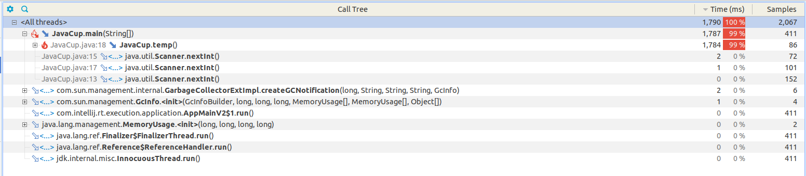
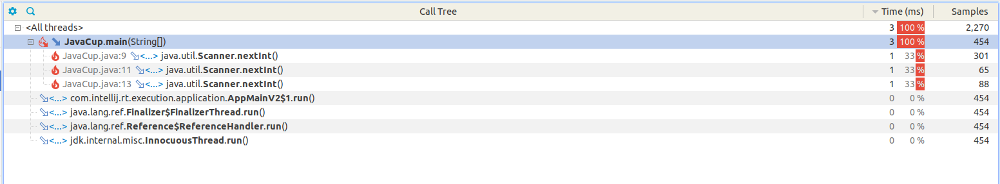
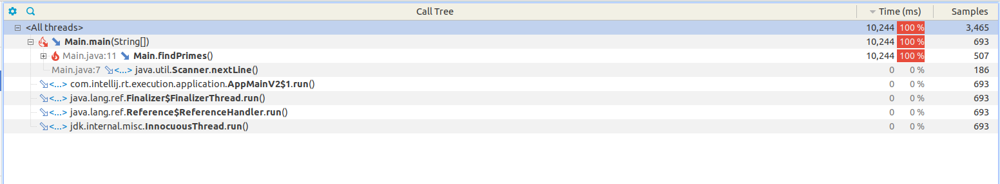
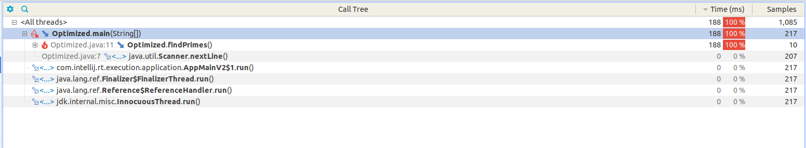

# تحلیل و بهینه‌سازی با YourKit

---

## مقدمه

در این پروژه، با استفاده از ابزار YourKit Java Profiler، دو برنامه جاوا مورد بررسی و تحلیل عملکرد (Profiling) قرار گرفتند. هدف اصلی، شناسایی بخش‌هایی از کد بود که بیشترین مصرف منابع (CPU و حافظه) را داشتند، و سپس بهینه‌سازی آن بخش‌ها به‌گونه‌ای که مصرف منابع کاهش یابد، بدون آنکه عملکرد برنامه مختل شود یا بخش‌هایی از آن حذف گردد.

---

## بخش اول: تحلیل و بهینه‌سازی تابع temp در JavaCup

### تحلیل اولیه

در پروژه‌ی JavaCup، تابع `()temp` مسئول بخش عظیمی از مصرف منابع بود. این تابع، دو حلقه‌ی تو در تو با حدود ۲۰۰ میلیون تکرار اجرا می‌کرد و حاصل جمع اندیس‌ها را به صورت مداوم در یک `ArrayList` بدون اندازه اولیه مشخص، ذخیره می‌کرد.

در اجرای اولیه:
- مصرف حافظه و زمان اجرا بسیار بالا میباشد.



### نسخه اولیه تابع:

```java
public static void temp() {
    ArrayList a = new ArrayList();
    for(int i = 0; i < 10000; ++i) {
        for(int j = 0; j < 20000; ++j) {
            a.add(i + j);
        }
    }
}
```

### بهینه‌سازی اعمال‌شده

- تخصیص اولیه ظرفیت برای `ArrayList` با استفاده از `new ArrayList<>(row * col)` را انجام دادیم تا از رشد پیاپی آن در حین اجرا جلوگیری شود.

با این بهینه‌سازی، مصرف حافظه کاهش یافته و از ایجاد چندباره آرایه‌های پنهانی در حافظه جلوگیری شده، بدون آنکه در منطق یا ابعاد حلقه تغییری ایجاد شود.


### نسخه بهینه‌شده:

```java
public static void temp() {
    int row = 10000;
    int col = 20000;
    ArrayList<Integer> a = new ArrayList<>(row * col);

    for (int i = 0; i < row; ++i) {
        int base = i;
        for (int j = 0; j < col; ++j) {
            a.add(base + j);
        }
    }
}
```

### نتایج

پس از بهینه‌سازی:
- مصرف CPU و حافظه کاهش یافته.
- تابع `()temp` دیگر در بالای لیست مصرف‌کنندگان منابع نمیباشد.



---

## بخش دوم: تحلیل تابع جست‌وجوی اعداد اول

### تحلیل اولیه

در این بخش، تابع `()fimdPrimes` برای شمارش تعداد اعداد اول تا مرز یک میلیون، به صورت تکراری اجرا میشود (۵۰ بار). هدف، ایجاد بار سنگین محاسباتی برای مشاهده در ابزار پروفایلینگ میباشد.

### نسخه اولیه تابع:

```java
public static void findPrimes() {
    int count = 0;
    for (int i = 2; i < 1_000_000; i++) {
        boolean isPrime = true;
        for (int j = 2; j * j <= i; j++) {
            if (i % j == 0) {
                isPrime = false;
                break;
            }
        }
        if (isPrime) count++;
    }
    System.out.println("Primes found: " + count);
}
```

### نتایج پروفایل اولیه:

- تابع `()findPrimes` بیش از ۹۹٪ زمان CPU را به خود اختصاص میدهد.
- کاملاً به عنوان گلوگاه (bottleneck) قابل شناسایی میباشد.



---

### بهینه‌سازی انجام‌شده

در نسخه‌ی بهینه‌سازی‌شده، چند تغییر مؤثر اعمال شد:

1. بررسی فقط اعداد فرد (اعداد زوج بعد از ۲ قطعا اول نیستند)
2. شروع از ۳ به‌جای ۲
3. افزایش گام حلقه داخلی به ۲ (بررسی فقط مقسوم‌علیه‌های فرد)
4. محاسبه ریشه دوم عدد فقط یک‌بار به‌جای تکرار در هر تکرار حلقه

### نسخه بهینه‌شده:

```java
public static void findPrimes() {
    int count = 0;

    if (1_000_000 >= 2) {
        count++;  // 2 is prime
    }

    for (int i = 3; i < 1_000_000; i += 2) {
        boolean isPrime = true;
        int sqrt = (int) Math.sqrt(i);

        for (int j = 3; j <= sqrt; j += 2) {
            if (i % j == 0) {
                isPrime = false;
                break;
            }
        }

        if (isPrime) count++;
    }

    System.out.println("Primes found: " + count);
}
```


### نتایج نهایی

پس از اعمال بهینه‌سازی:
- زمان اجرای کلی کاهش یافت.
- مصرف CPU تابع `()findPrimes` کمتر شد.

---

## نتیجه‌گیری

در این پروژه دو تابع سنگین مورد بررسی و تحلیل قرار گرفتند. با استفاده از ابزار YourKit:

- ابتدا بخش‌هایی از کد که بار محاسباتی و حافظه‌ای بالایی داشتند شناسایی شدند.
- سپس این بخش‌ها به شیوه‌ای منطقی و قابل قبول، بدون حذف عملکرد، بهینه‌سازی شدند.
- تفاوت عملکرد قبل و بعد از بهینه‌سازی در گزارش‌ها و نمودارهای YourKit کاملاً مشهود است.

 لینک پروژه: [SE-Lab-G4/exp-05 (Branch: final-merge)](https://github.com/SE-Lab-G4/exp-05)

